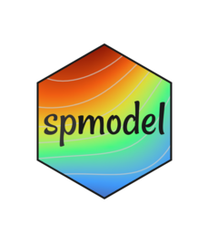

# spmodel: Spatial Statistical Modeling and Prediction <a href="https://usepa.github.io/spmodel/"></a>

<!-- badges: start -->
[](https://www.repostatus.org/#active)
[](https://cran.r-project.org/package=spmodel)
[](https://github.com/USEPA/spmodel/actions/workflows/R-CMD-check.yaml)
[](https://cran.r-project.org/web/checks/check_results_spmodel.html)
<!-- badges: end -->

## Overview

spmodel is an R package used to fit, summarize, and predict for a variety of spatial statistical models
applied to point-referenced and areal (lattice) data.
Parameters are estimated using various methods, including
likelihood-based optimization and weighted least squares based on variograms. Additional
modeling features include anisotropy, non-spatial random effects, partition factors,
big data approaches, and more. Model-fit statistics are used to summarize, visualize,
and compare models. Predictions at unobserved locations are readily obtainable.
Visit our website at [https://usepa.github.io/spmodel/](https://usepa.github.io/spmodel/).

## Installation

Install and load the most recent approved version from CRAN by running
```r
# install the most recent approved version from CRAN
install.packages("spmodel")
# load the most recent approved version from CRAN
library(spmodel)
```

Install and load the most recent development version of`spmodel` from GitHub by running
```r
# Installing from GitHub requires you first install the remotes package
install.packages("remotes")

# install the most recent development version from GitHub
remotes::install_github("USEPA/spmodel", ref = "main")
# load the most recent development version from GitHub
library(spmodel)
```

Install the most recent development version of `spmodel` from GitHub with package vignettes by running
```r
install the most recent development version from GitHub with package vignettes
devtools::install_github("USEPA/spmodel", ref = "main", build_vignettes=TRUE)
```

View the introductory vignette in RStudio by running
```r
vignette("introduction", "spmodel")
```

We have several other vignettes that are not shipped with CRAN but are available on our website (located at [https://usepa.github.io/spmodel/](https://usepa.github.io/spmodel/)) in the "Articles" tab:

1. A Detailed Guide to spmodel
2. Spatial Generalized Linear Models in spmodel
3. Technical Details

Further detail regarding spmodel is contained in the package's documentation manual. 

## Citation

If you use spmodel in a formal publication or report, please cite it. Citing spmodel lets us devote more resources to it in the future. View the spmodel citation by running
```{r}
citation(package = "spmodel")
```

```
#> 
#> To cite spmodel in publications use:
#> 
#>   Dumelle M, Higham M, Ver Hoef JM (2023). spmodel: Spatial statistical modeling and prediction in R. PLOS ONE, 18(3): e0282524.
#>   https://doi.org/10.1371/journal.pone.0282524
#> 
#> A BibTeX entry for LaTeX users is
#> 
#>   @Article{,
#>     title = {{spmodel}: Spatial statistical modeling and prediction in {R}},
#>     author = {Michael Dumelle and Matt Higham and Jay M. {Ver Hoef}},
#>     journal = {PLOS ONE},
#>     year = {2023},
#>     volume = {18},
#>     number = {3},
#>     pages = {1--32},
#>     doi = {10.1371/journal.pone.0282524},
#>     url = {https://doi.org/10.1371/journal.pone.0282524},
#>   }
```

## Package Contributions

We encourage users submit GitHub issues and enhancement requests so we may
continue to improve spmodel.

## EPA Disclaimer

The United States Environmental Protection Agency (EPA) GitHub project code is provided on an "as is" basis and the user assumes responsibility for its use. EPA has relinquished control of the information and no longer has responsibility to protect the integrity , confidentiality, or availability of the information. Any reference to specific commercial products, processes, or services by service mark, trademark, manufacturer, or otherwise, does not constitute or imply their endorsement, recommendation or favoring by EPA. The EPA seal and logo shall not be used in any manner to imply endorsement of any commercial product or activity by EPA or the United States Government.

## License

This project is licensed under the GNU General Public License, [GPL-3](https://cran.r-project.org/web/licenses/GPL-3).  
